# Project Title

## Overview

GemBuddy serves as a dynamic platform where individuals can join meetings with local experts, such as tourist guides, or connect with others seeking companionship for activities like hiking or exploring wildlife in the Rocky Mountains. Our application not only offers comprehensive information about the Rocky Mountains but also facilitates connections between users seeking to explore the area and knowledgeable user guides. Users can engage in clarifying queries and seamlessly finalize arrangements for guided tours.

### Problem

The Rocky Mountains encompass a vast area offering numerous activities, but finding options beyond the popular tourist attractions can be challenging for those unfamiliar with the region. Additionally, many activities in and around the mountains are best enjoyed with experienced companions who are familiar with the area's potential dangers, such as getting lost or encountering wildlife. Therefore, having companionship can enhance safety and overall enjoyment of the outdoor experiences. 

### User Profile

"Users seeking meet-ups with local guides or fellow users can utilize our platform seamlessly. Through our platform, users can effortlessly browse available guides or meet-ups based on their location and preferred tour options. They can easily connect with these guides or other users to book services or participate in meetings."

 User guides - On the other hand, are passionate individuals offering guide services within their region. By registering on our website, they gain the opportunity to showcase their expertise by listing their services along with pricing details. This allows them to reach a wider audience of travellers seeking authentic experiences tailored to their preferences."

### Features

- As a user, I want to be able to find a local guides in the areas of the park that i want to visit. 
- As a user, I want to be able to contact this guide for questions and contact their service. 
- As a user, i want to be able to contact other people organizing meet ups, just to do activities as a group.
- As a user, I want to see a list of meetings that I can filter by price. 
- As a user, I want to organize a meet-up and add it to the list of meetings. 
- As a user, I want to be able to delete a meeting that I regreted creating. 

## Implementation

### Tech Stack

- React
- MySQL
- Express
- Client libraries: 
    - react
    - react-router
    - axios
- Server libraries:
    - knex
    - express

### APIs

Create a API for the guides using mySQL. 

### Sitemap

Main Page: 
-Provides general information about the website.
-Allows travellers to input their park destination.

Park Page:
-Displays information about the selected park, including the list of activities available in that area.
-Lists available activities in that region.

Meetings Page:
-Shows a list of tours related with the activie you selected
-Filter if you want to meet a local and pay for a meeting or meet up with a group of users for the companionship. 
-Create meetings.
-Delete Mettings.
-Show interest in meetings and contact the organizers of the meetings.

Add Meetings:
-Form to add a new meeting

Organizer Page:
-See infomation about the organizer of the meeting you are interested.
-Contact this organizer for inquires, questions, or concerns. 

Interested Page:
-Form to contact the organizer showing interest.

### Mockups

#### Home Page
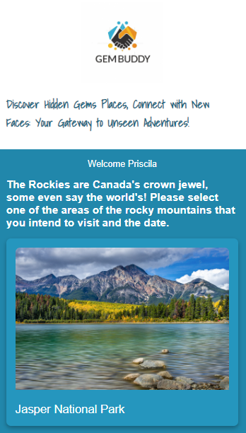
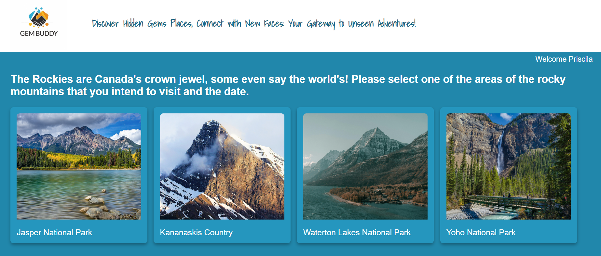

#### Parks Page
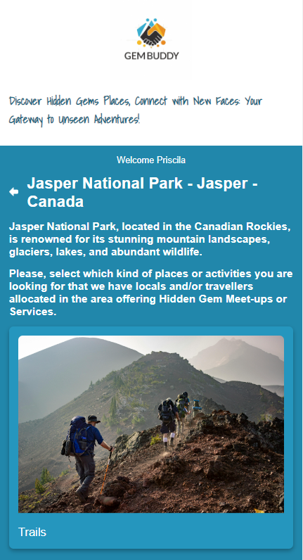
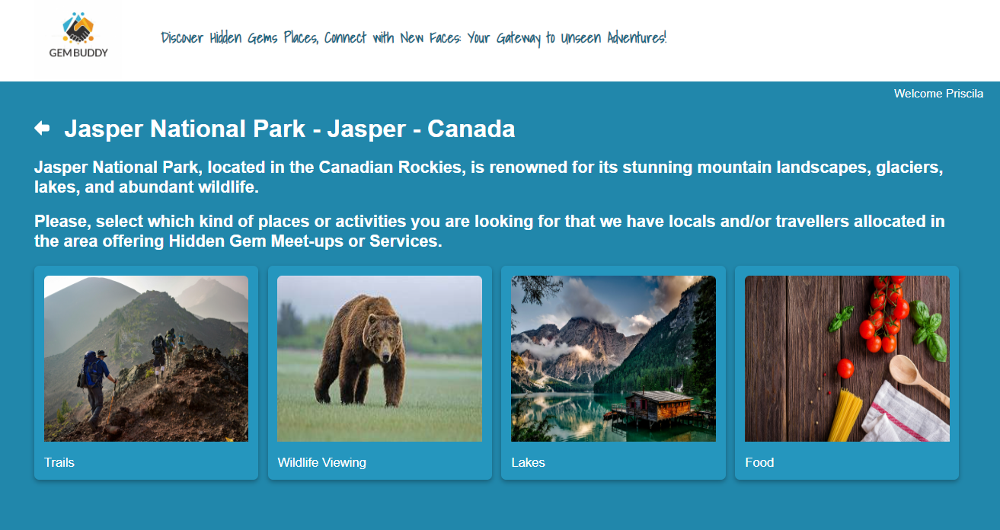

#### Buddy-ups Page
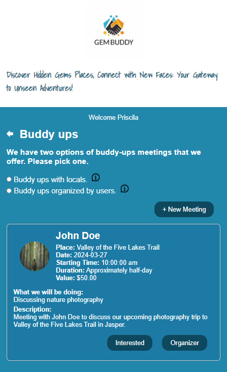
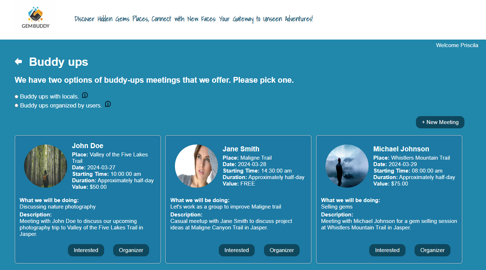

#### Add-Meetings Page
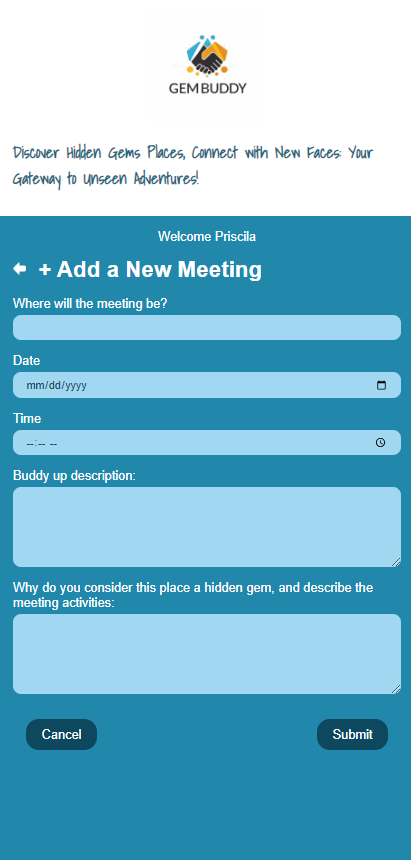
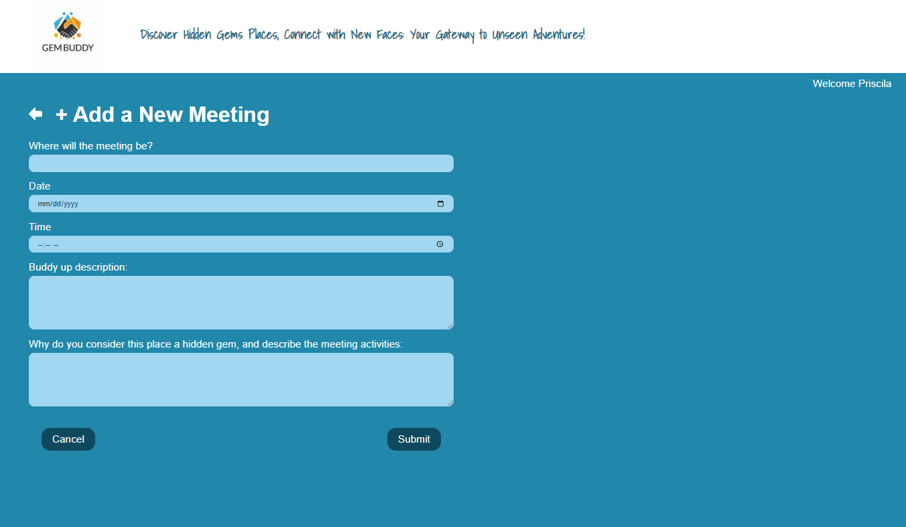

#### Interested Page
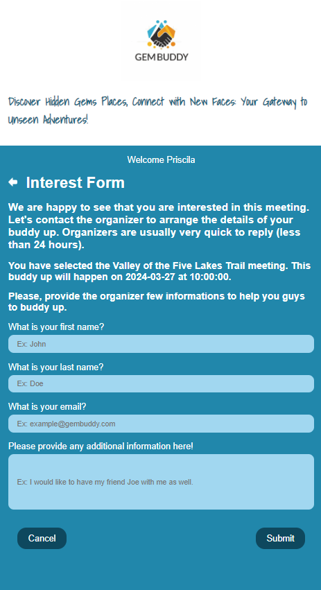
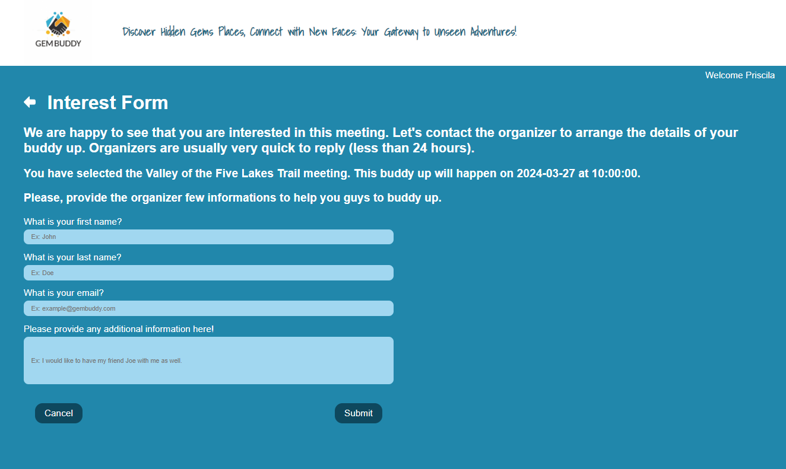

#### Organizer Page
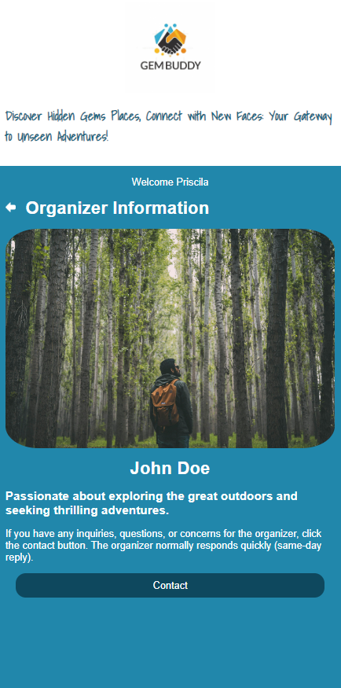
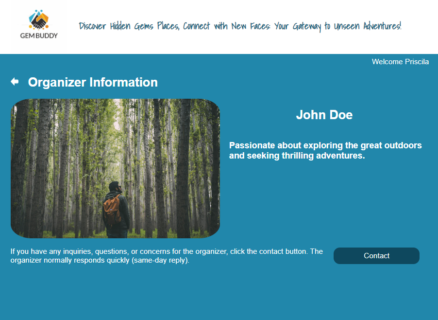

### Contact Organizer page
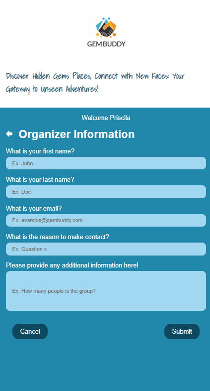
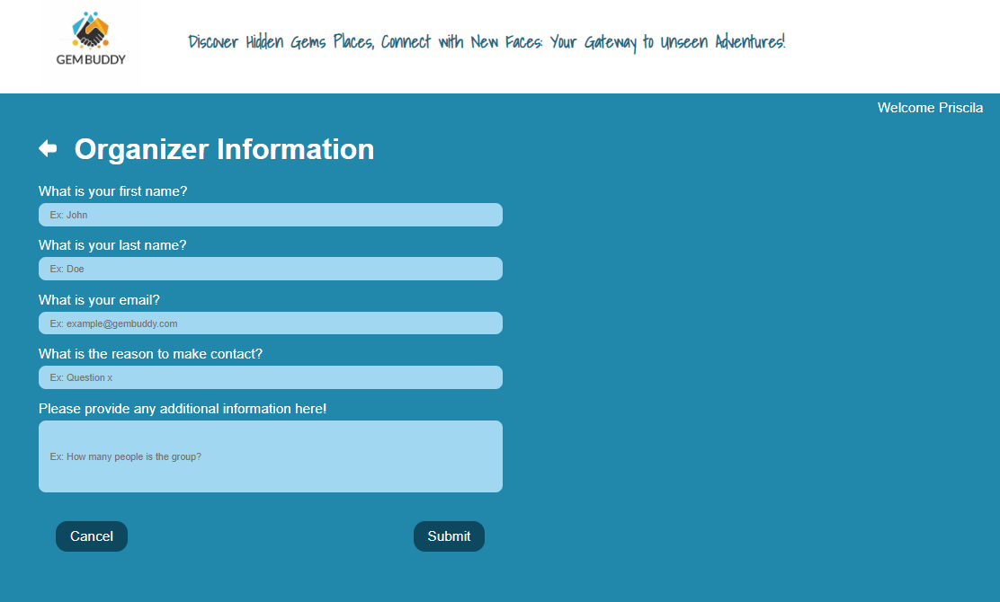

### Endpoints

**GET /api/parks**

- Get the list of parks available in the area. 

Response:
```
[
    {
        "id": 1,
        "park_name": "Jasper National Park",
        "image": "/images/Jasper.jpg",
        "city": "Jasper",
        "country": "Canada",
        "description": "Jasper National Park, located in the Canadian Rockies, is renowned for its stunning mountain landscapes, glaciers, lakes, and abundant wildlife.",
        "created_at": "2024-03-24T04:47:15.000Z",
        "updated_at": "2024-03-24T04:47:15.000Z"
    },
    ...
]
```

**GET /api/parks/:id**

- Returns a unique park, selected by id.

Response:
```
{
    "id": 1,
    "park_name": "Jasper National Park",
    "image": "/images/Jasper.jpg",
    "city": "Jasper",
    "country": "Canada",
    "description": "Jasper National Park, located in the Canadian Rockies, is renowned for its stunning mountain landscapes, glaciers, lakes, and abundant wildlife.",
    "created_at": "2024-03-24T04:47:15.000Z",
    "updated_at": "2024-03-24T04:47:15.000Z"
}
```
**GET/api/activities/:id**

- Returns a list of activities related with the park selected.

Response:
```
{
    "id": 1,
    "park_id": 1,
    "activitie": "Trails",
    "image": "images/Hiking.jpg",
    "description": "Hiking in the Canadian Rockies offers adventurers a chance to immerse themselves in the stunning natural beauty of the mountainous landscape.",
    "created_at": "2024-03-26T20:17:02.000Z",
    "updated_at": "2024-03-26T20:17:02.000Z"
}
```


**GET/api/mettings/:id**

- Returns a list of meetings related with the activitie selected.

Response:
```
{
        "id": 1,
        "user_id": 1,
        "place": "Valley of the Five Lakes Trail",
        "date": "2024-03-27T06:00:00.000Z",
        "hour": "10:00:00",
        "receive_payment": 1,
        "value": "50.00",
        "description_gem": "Discussing nature photography",
        "description_meeting": "Meeting with John Doe to discuss our upcoming photography trip to Valley of the Five Lakes Trail in Jasper.",
        "activity_id": 1,
        "first_name": "John",
        "last_name": "Doe",
        "image": "/images/person1.jpeg"
    }

```

**POST/api/mettings/:id**

- Post a new meeting realted with the park and activitie selected. Response 201 Created. 

Response:
```
{
    "id": 43,
    "user_id": 10,
    "place": "Test Trail",
    "date": "2024-04-27",
    "hour": "11:00:00",
    "receive_payment": 1,
    "value": 50,
    "description_gem": "Most beatiful lake around",
    "description_meeting": "Meeting with Priscila to make a hike and discover an hiden waterfall.",
    "activity_id": 1
}
```

**GET//api/mettings/meeting/:id**

- Returns a unique meeting selected. 


Response:
```
{
    "id": 1,
    "user_id": 1,
    "place": "Valley of the Five Lakes Trail",
    "date": "2024-03-27T06:00:00.000Z",
    "hour": "10:00:00",
    "receive_payment": 1,
    "value": "50.00",
    "description_gem": "Discussing nature photography",
    "description_meeting": "Meeting with John Doe to discuss our upcoming photography trip to Valley of the Five Lakes Trail in Jasper.",
    "activity_id": 1,
    "first_name": "John",
    "last_name": "Doe",
    "image": "/images/person1.jpeg",
    "email": "john@example.com",
    "description": "Passionate about exploring the great outdoors and seeking thrilling adventures."
}
```

**GET//api/mettings/meeting/:id**

- Delete meeting selected.

### Auth

To be implemented in a next iteration. 

## Roadmap

- Create client
    - react project with routes and boilerplate pages

- Create server
    - express project with routing, with placeholder 200 responses

- Create migrations

- Gather all the parks around the rocky mountain, , 4 different activities, 10 users, 10 different meetings. 

- Create seeds.

- Deploy client and server projects so all commits will be reflected in production.

Feature Main Page: 
-Provides general information about the website.
-Allows travellers to input their destination and dates.

Feature Park Page:
-Displays information about the selected park, including the list of activities available in that area.
-Lists available activities in that region.

Feature Meetings Page:
-Shows a list of tours related with the activie you selected
-Filter if you want to meet a local and pay for a meeting or meet up with a group of users for the companionship. 
-Create meetings.
-Delete Mettings.
-Show interest in meetings and contact the organizers of the meetings.

feature Add Meetings:
-Form to add a new meeting

Feature Organizer Page:
-See infomation about the organizer of the meeting you are interested.
-Contact this organizer for inquires, questions, or concerns. 

Feature Interested Page:
-Form to contact the organizer showing interest.

## Nice-to-haves

Login Pages:
-Separate login flows for travellers and guides to access personalized features.

Payment Flow:
-Integration of a payment system to facilitate booking and payment for guide services directly through the website.
-These features will provide a comprehensive platform for travellers to find, evaluate, and book guide services for their desired destinations, while also empowering guides to showcase their expertise and services effectively.