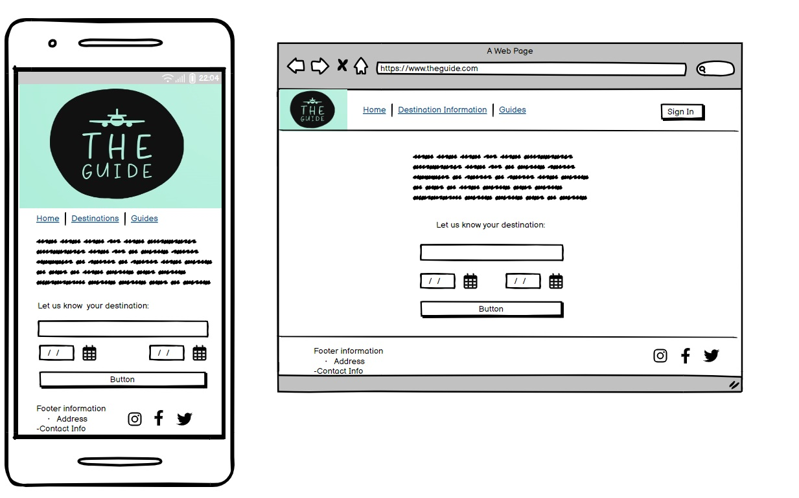
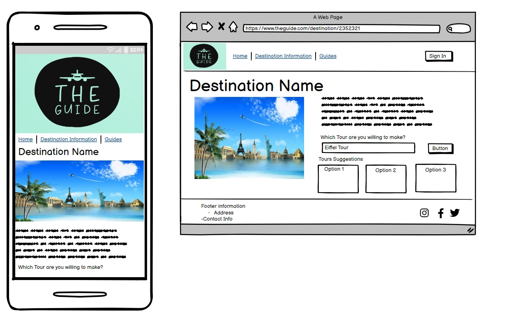
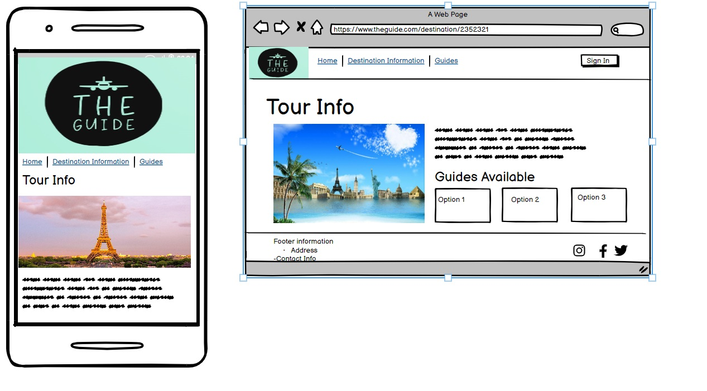
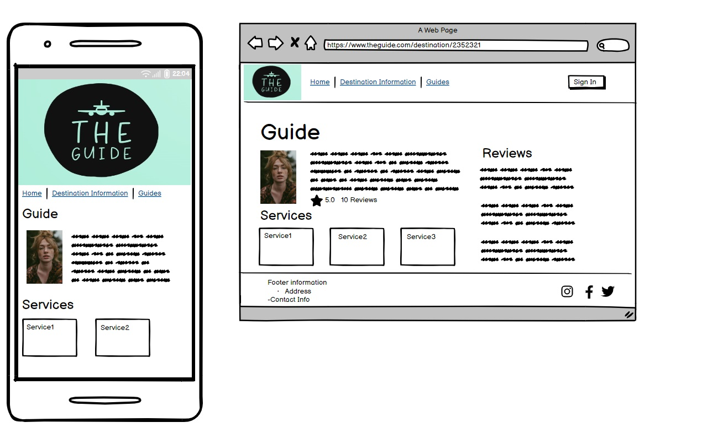
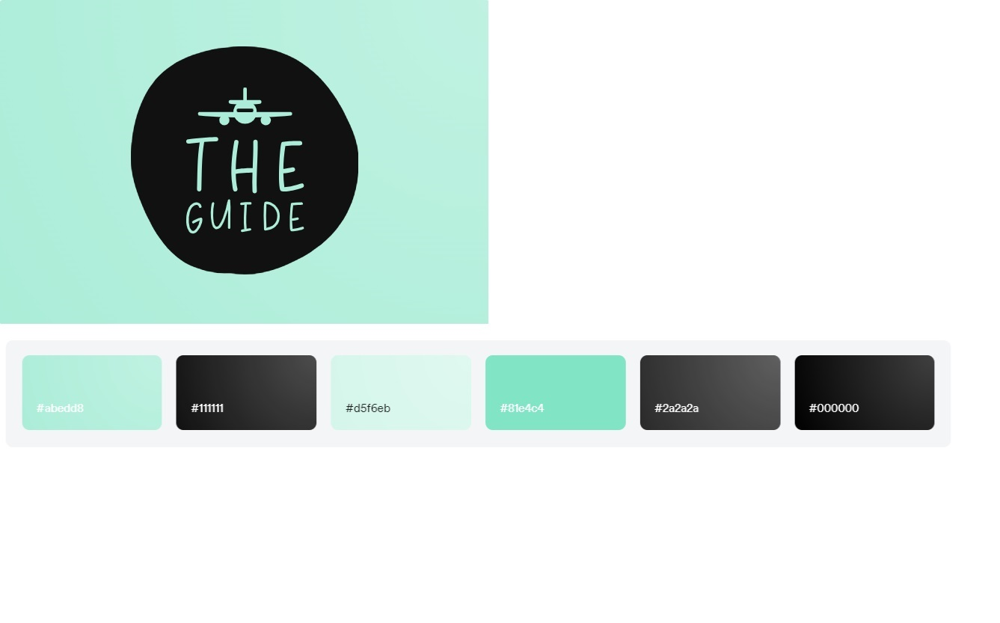
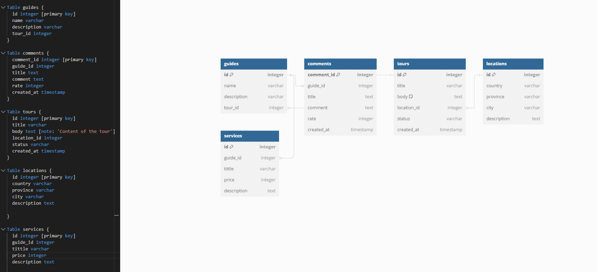

# Project Title

## Overview

The Guide serves as a dynamic platform bridging travelers with local tourist guides for tailored tours in various destinations. Our application not only provides comprehensive destination insights but also showcases a variety of tours available and connects users with proficient guides offering personalized services. Users can review guides, engage in clarifying queries, and finalize guided tour arrangements seamlessly.

### Problem

"Exploring numerous locales across countries, states (provinces), cities, and tourist hotspots presents an extensive array of options for integration into the application. To streamline this process, I plan to leverage the GeoDB API, initially focusing on data from Canada. Additionally, setting up a server with endpoints tailored for guides' profiles is essential. Integrating a map feature to visually represent locations is wanted, albeit requiring further learning on my part. Implementing a secure charge flow for guide services may pose challenges, particularly in terms of validation procedures, which I anticipate tackling as part of the project's development."

### User Profile

"Travellers - Individuals seeking local travel guides who offer personalized experiences in specific locations and tours. Through our platform, travellers can effortlessly browse guides based on their location and preferred tour options. They can review guides based on previous evaluations and easily connect with them to book their services.

Guides - On the other hand, are passionate individuals offering guide services within their region. By registering on our website, they gain the opportunity to showcase their expertise by listing their services along with pricing details. This allows them to reach a wider audience of travellers seeking authentic experiences tailored to their preferences."

### Features

- As a user, I want to be able to find a local guide in the location I am travelling. 
- As a user, I want to be able to contact this guide for questions and contact their service. 
- As a user, I want to see a list of guides that I can filter by price or by rate. 
- As a user, I want to see a list of services that this guides offer with prices based on the location selected. 

- As a user, I want to be able comment on guides. 

## Implementation

### Tech Stack

- React
- MySQL
- Express
- Client libraries: 
    - react
    - react-router
    - axios
- Server libraries:
    - knex
    - express
    - bcrypt for password hashing (maybe)

### APIs

Create a API for the guides using mySQL. 

### Sitemap

Main Page: 
-Provides general information about the website.
-Allows travellers to input their destination and dates.

Destination Page:
-Displays information about the selected destination, including attractions, points of interest, and activities.
-Lists available tours in that region.

Tour Page:
-Shows details of a specific tour.
-Provides a list of guides offering that tour, which can be filtered based on their evaluations.

Guide Page:
-Presents detailed information about a specific guide, including their profile, experience, and specialization.
-Displays comments and reviews from previous travellers.
-Lists the services offered by the guide, filtered based on the selected location.

Service Page:
-Displays options for the selected service offered by the guide.
-Includes pricing information and allows travellers to contact the guide for questions or booking.


### Mockups

#### Home Page


#### Destination Page


#### Tour Page


#### Guide Page


#### Service Page


#### Logo and color scheme


### Data



### Endpoints

**GET /location/:id**

- Get location selected by the user to present information abou te location selected. 

Response:
```
[
    {
        "id": 1,
        "country": "Canada",
        "province": "Alberta",
        "city: "Banff"
        "description": "Located on the rocky mountains..."
    },
    ...
]
```

**GET/guides**

- Returns a list of guides that offers services in location selected. 


Response:
```
{
    "name": "John Doe,
    "description ": " Local of the Banff area Jonh...",
}, 
{
    "name": "John Doe,
    "description ": " Local of the Banff area Jonh...",
}
```
**GET/guide/:id**

- Returns a specific guide information selected. 


Response:
```
{
    "name": "John Doe,
    "description ": " Local of the Banff area Jonh...",
}
```


**GET/tours**

- Returns a list of tours related with the location selected 


Response:
```
{
    "id": 1,
    "tittle ": "Lake Louise",
    "body": Lake Louise is located in the heart of the rocky mountains, with emerald color water...
}, 
{
    "id": 1,
    "tittle ": "Lake Louise",
    "body": Lake Louise is located in the heart of the rocky mountains, with emerald color water...
}, 

```

**GET/tour/id**

- Returns a selected tour 


Response:
```
{
    "id": 1,
    "tittle ": "Lake Louise",
    "body": Lake Louise is located in the heart of the rocky mountains, with emerald color water...
}
```

**GET/services**

- Returns a list of services offered by guide selected.


Response:
```
{
    "id": 1,
    "tittle ": "Hiking at Lake Louise",
    "description": Lake Louise is located in the heart of the rocky mountains, with emerald color water...,
    "price: : 100,
}
```

**GET/service/"id**

- Returns a service offered by guide selected.


Response:
```
{
    "id": 1,
    "tittle ": "Hiking at Lake Louise",
    "description": Lake Louise is located in the heart of the rocky mountains, with emerald color water...,
    "price: : 100,
}
```

**POST /comment**

- Post a comment and rate your guide. 


Response:
```
{
    "id": 1,
    "name": "John Doe",
    "guide_id": 1,
    "comment ": "Best guide in town" ,
    "userRating": 5,
    "
}
```

**get/comments**

- Gets the list of comments related with user

Response:
```
{
    {
    "id": 1,
    "name": "John Doe",
    "comment ": "Best guide in town" ,
    "userRating": 5,
    "
}
}
```

### Auth

To be discussed if i will implement the Login page.  

## Roadmap

- Create client
    - react project with routes and boilerplate pages

- Create server
    - express project with routing, with placeholder 200 responses

- Create migrations

- Gather 2 location in Canada sample, 5 tours by city, 3 guides at least by tour, few comments to each guide, and few services that this guides can offer

- Create seeds.

- Deploy client and server projects so all commits will be reflected in production.

Feature Main Page: 
-Provides general information about the website.
-Allows travellers to input their destination and dates.

Feature Destination Page:
-Created the GET location and GET tour list.
-Displays information about the selected destination, including attractions, points of interest, and activities on the front end.
-Lists available tours in that region.

Feature Tour Page:
-Created the GET tour by id and GET guides list.
-Shows details of a specific tour.
-Provides a list of guides offering that tour, which can be filtered based on their evaluations.

Feature Guide Page:
-Create the GET specific guide and The GET list of guides
-Presents detailed information about a specific guide, including their profile, experience, and specialization.
-Displays comments and reviews from previous travellers.
-Lists the services offered by the guide, filtered based on the selected location.

Service Page:
- Create the GET point for the sevice selected. 
-Displays options for the selected service offered by the guide.
-Includes pricing information and allows travellers to contact the guide for questions or booking.

## Nice-to-haves

Login Pages:
-Separate login flows for travellers and guides to access personalized features.

Payment Flow:
-Integration of a payment system to facilitate booking and payment for guide services directly through the website.
-These features will provide a comprehensive platform for travellers to find, evaluate, and book guide services for their desired destinations, while also empowering guides to showcase their expertise and services effectively.